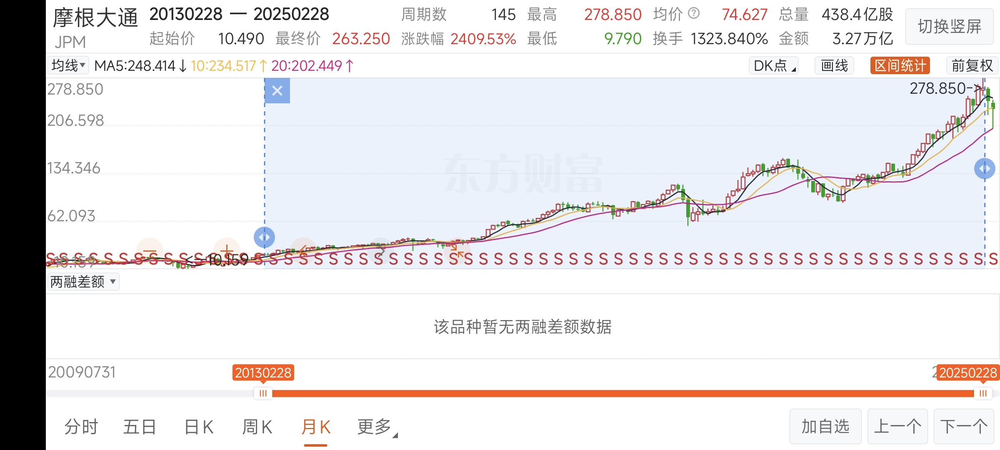
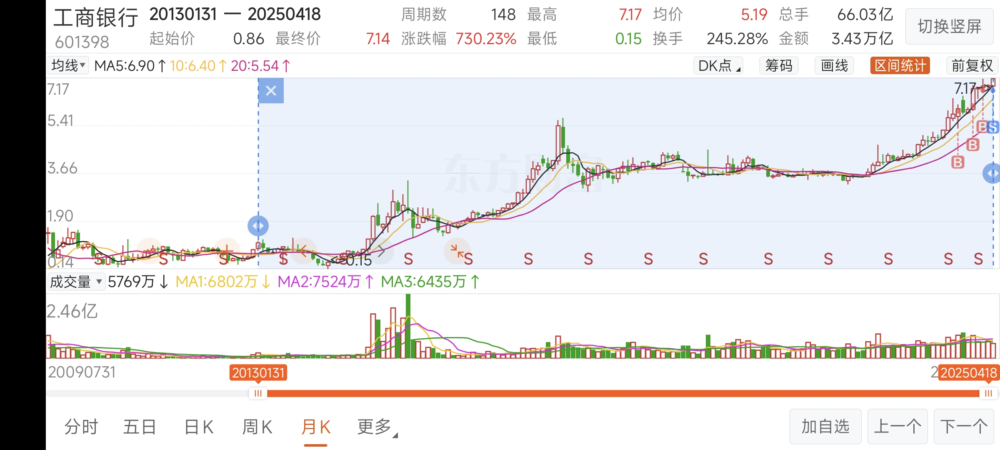
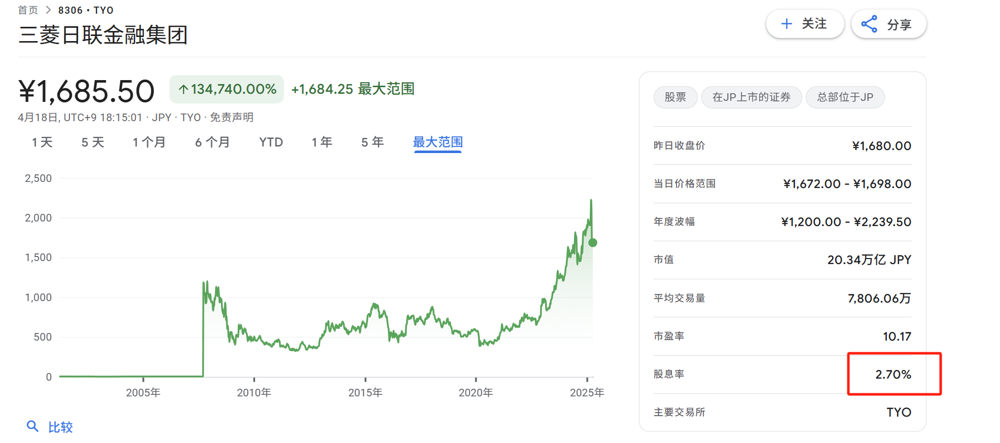
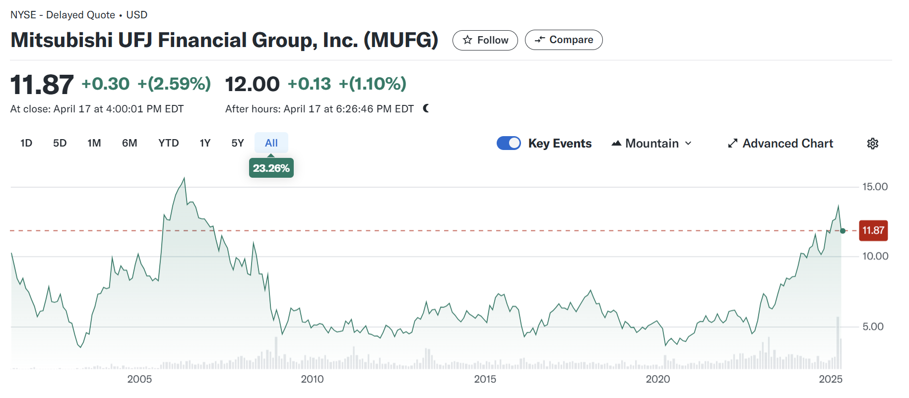
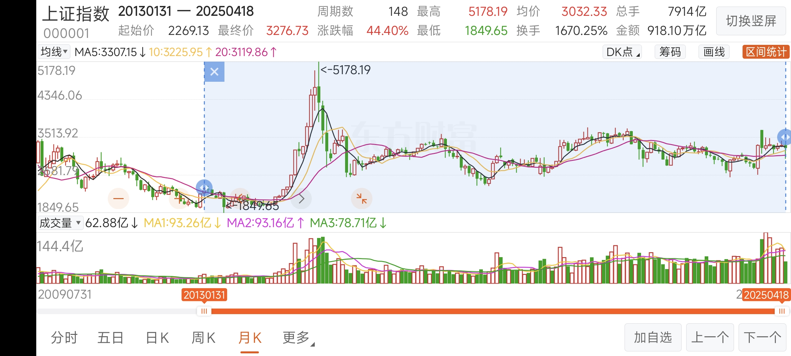
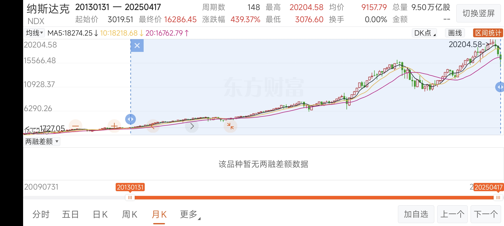

# target
年化10%
# invest
## bond
[国开行债券收益](https://yield.chinabond.com.cn/gkh/index)   
[建行存款利率](https://ccb.com/cn/personal/interestv3/rate-tool-cunkuan.html)   
[日本债市利率](https://stock.finance.sina.com.cn/stock/go.php/vReport_Show/kind/industry/rptid/763453488313/index.phtml)   
[日本债市2](https://wallstreetcn.com/articles/3710081)   
注意利率降到0.5%后基本债基就没有投资价值，   
目前（2024年12月4日）5年期利率为1.55%，国开行7-10债基收益率约为2%（与30年国债接近），   
2023年12月22日5年期存款利率为2%，对应债基收益率为2.776%，债基的相对收益率在走低（2-1.55）/1.55 < (2.776-2 )/2   
# 观察：   
1. 2024年12月4日，债基长期牛市难以为继，若利率一直下行，只有权益市场有配置价值。需要密切留意债市和利率动向
2. 20241204,[付鹏讲话](https://www.quzaobao.com/news/china/202412/0331630.html)
```
付鹏说，中国经济早在冠病疫情之前就已出现很大问题，最近几年情况不但没有改善，还进一步恶化。

他指出，中国国内人口萎缩、中产跌落、财富分配不均、有效需求不足，加杠杆的空间已到尽头。外部环境方面，全世界加速右转，特朗普二次执政后的贸易战将更加难以应对。内外交困之下，中国政府可打的牌非常有限，经济前景不容乐观。

在财富分配方面，付鹏认为，要解决问题，必须提振内需，内需的核心就是进行再分配。政府和居民之间、贫富之间、债务和杠杆之间都要再分配。

在消费问题上，付鹏指出，消费已经发生结构性变化及总量上的变化，食品、饮料、零售“都结束了”。

对于中产阶级，付鹏说，中产的跌落是普遍现象，现在投资创业，要么做富人的生意、要么做穷人的生意，必须放弃中间层。

对于人口问题，他说，大规模老龄化开启，年轻人不再生育，将是巨大的麻烦，因为所有债务的兜底没了。

对于房地产，付鹏指出，过去上涨主要建立在两个基础上，一是人口红利，二是加杠杆。现在需要年轻人来当“接盘侠”，但年轻人的接盘能力严重不足，这个模式已经难以为继。

对于A股，付鹏说，所谓牛市都是说给散户听的，中国股市跟经济有时候是反向关系，经济越差的时候，某只手就越会出动，让人往里投钱，再把钱给圈住。

对于大学生就业，他建议，孩子不是富二代的，就别卷学历了，以后学历没有太大价值，还不如到有钱人家当“赘婿”。

对于新兴产业，付鹏警告，爱国已经成为一种生意，“你只要说这东西遥遥领先，8000块钱的东西就能卖18000”。哪怕10家公司中有九家是骗子，都得认，“你必须明白国家主义的特征”。

对于汇率，付鹏认为，明年不容乐观，利率、汇率、财政三方面政策腾挪空间有限，利率可能破2，汇率估计在7.3至7.8。

对于中美贸易战，他指出，随着全球右翼政治兴起，欧美正在建立排除中国的新贸易体系。特朗普今年再次当选美国总统，中国面临的这场仗，比2016年那届还难打。
```   

## stock
### 红利
[世界最大银行列表](https://en.wikipedia.org/wiki/List_of_largest_banks)     

银行稳妥    
一些银行对比
JPmorgan chase

工商银行

最差的可能，三菱    


上证指数


都远胜NASDAQ指数


### 优质股
