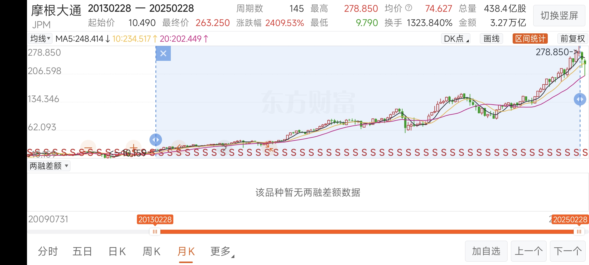
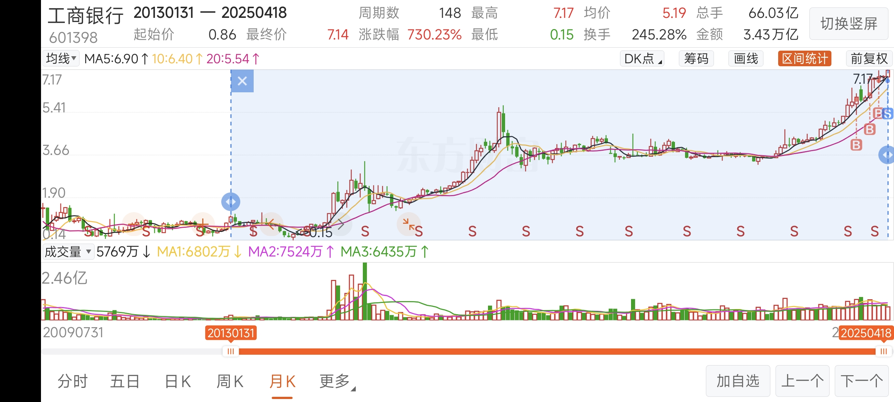
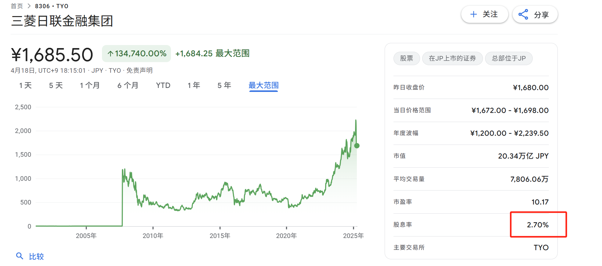
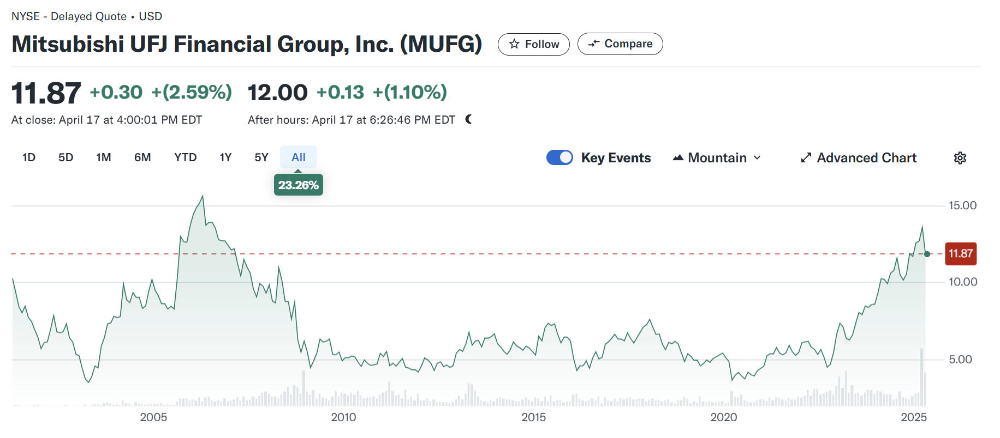
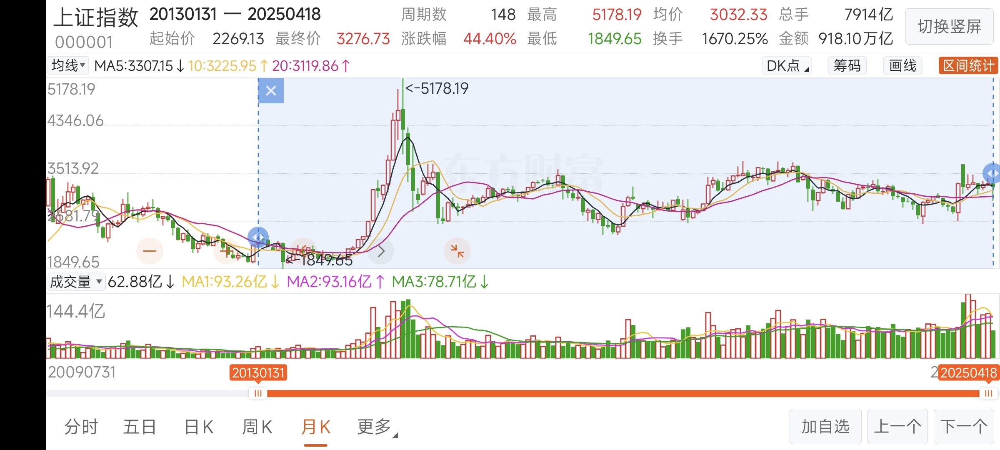
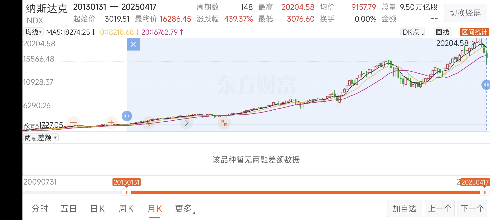

# target
年化10%
# invest
## bond
[国开行债券收益](https://yield.chinabond.com.cn/gkh/index)   
[建行存款利率](https://ccb.com/cn/personal/interestv3/rate-tool-cunkuan.html)   
[日本债市利率](https://stock.finance.sina.com.cn/stock/go.php/vReport_Show/kind/industry/rptid/763453488313/index.phtml)   
[日本债市2](https://wallstreetcn.com/articles/3710081)   
注意利率降到0.5%后基本债基就没有投资价值，   
目前（2024年12月4日）5年期利率为1.55%，国开行7-10债基收益率约为2%（与30年国债接近），   
2023年12月22日5年期存款利率为2%，对应债基收益率为2.776%，债基的相对收益率在走低（2-1.55）/1.55 < (2.776-2 )/2   
# 观察：   
1. 2024年12月4日，债基长期牛市难以为继，若利率一直下行，只有权益市场有配置价值。需要密切留意债市和利率动向
2. 20241204,[付鹏讲话](https://www.quzaobao.com/news/china/202412/0331630.html)
```
付鹏说，中国经济早在冠病疫情之前就已出现很大问题，最近几年情况不但没有改善，还进一步恶化。

他指出，中国国内人口萎缩、中产跌落、财富分配不均、有效需求不足，加杠杆的空间已到尽头。外部环境方面，全世界加速右转，特朗普二次执政后的贸易战将更加难以应对。内外交困之下，中国政府可打的牌非常有限，经济前景不容乐观。

在财富分配方面，付鹏认为，要解决问题，必须提振内需，内需的核心就是进行再分配。政府和居民之间、贫富之间、债务和杠杆之间都要再分配。

在消费问题上，付鹏指出，消费已经发生结构性变化及总量上的变化，食品、饮料、零售“都结束了”。

对于中产阶级，付鹏说，中产的跌落是普遍现象，现在投资创业，要么做富人的生意、要么做穷人的生意，必须放弃中间层。

对于人口问题，他说，大规模老龄化开启，年轻人不再生育，将是巨大的麻烦，因为所有债务的兜底没了。

对于房地产，付鹏指出，过去上涨主要建立在两个基础上，一是人口红利，二是加杠杆。现在需要年轻人来当“接盘侠”，但年轻人的接盘能力严重不足，这个模式已经难以为继。

对于A股，付鹏说，所谓牛市都是说给散户听的，中国股市跟经济有时候是反向关系，经济越差的时候，某只手就越会出动，让人往里投钱，再把钱给圈住。

对于大学生就业，他建议，孩子不是富二代的，就别卷学历了，以后学历没有太大价值，还不如到有钱人家当“赘婿”。

对于新兴产业，付鹏警告，爱国已经成为一种生意，“你只要说这东西遥遥领先，8000块钱的东西就能卖18000”。哪怕10家公司中有九家是骗子，都得认，“你必须明白国家主义的特征”。

对于汇率，付鹏认为，明年不容乐观，利率、汇率、财政三方面政策腾挪空间有限，利率可能破2，汇率估计在7.3至7.8。

对于中美贸易战，他指出，随着全球右翼政治兴起，欧美正在建立排除中国的新贸易体系。特朗普今年再次当选美国总统，中国面临的这场仗，比2016年那届还难打。
```   

## stock
### 红利
[世界最大银行列表](https://en.wikipedia.org/wiki/List_of_largest_banks)     

银行稳妥    
一些银行对比
JPmorgan chase

工商银行

最差的可能，三菱    


上证指数


都远胜NASDAQ指数


### 优质股

---

## 📈 本周 A 股走势分析（2026 年 3 月 4 日）

### 一、主要指数表现

| 指数 | 点位 | 涨跌额 | 涨跌幅 |
|------|------|--------|--------|
| **上证指数** | 4082.47 | -40.21 | -0.98% |
| 深证成指 | 13917.75 | -104.64 | -0.75% |
| 创业板指 | 3164.37 | -45.11 | -1.41% |
| 沪深 300 | 4602.62 | -53.28 | -1.14% |

**整体特征**：三大指数全线调整，沪指失守 4100 点，呈现高开低走、震荡下挫态势。

---

### 二、成交量变化

- **市场大幅缩量**：全天缩量近 8000 亿，上午缩量超 3700 亿
- **创业板指放量下跌**：与大盘缩量形成对比
- **资金流向**：逾 4800 只个股下跌，资金呈现逃离态势

---

### 三、板块表现

#### 🔥 领涨板块
| 板块 | 驱动因素 |
|------|----------|
| **电网设备** | 国内电改与海外需求共振，多股业绩有望高增长 |
| **种植业/农业** | 地缘冲突推升粮食安全预期，政策利好密集 |
| **军工** | 全线爆发，三重利好驱动 |
| **油气** | 近 115 亿元资金涌入油气主题 ETF，地缘催化 |
| **船舶制造** | 行业景气度提升 |

#### ❌ 领跌板块
| 板块 | 表现 |
|------|------|
| **焦炭** | 领跌 |
| **石油** | 集体暴跌，主力资金疯狂流出 |
| **AI/科技** | 资金大逃离，AI 交易熄火 |
| **房地产** | 板块承压 |

---

### 四、市场情绪分析

#### 😟 情绪特征
1. **避险情绪升温**：中东地缘政治风险外溢，引发资金避险
2. **观望情绪浓厚**：市场缩量调整，交投活跃度下降
3. **个股普跌**：仅 2 只基金跌逾 3%，但个股普跌超 4800 只

#### 💡 机构观点
| 机构 | 观点 |
|------|------|
| 多家机构 | 市场中长期向好趋势未变 |
| 26 位首席经济学家 | 对中国经济有信心，战略看多 A 股 |
| 中信证券 | 把握高性价比布局窗口 |
| 国泰海通张忆东 | 看好港股未来机会 |

---

### 五、后市展望

**支撑位**：4070 点附近

**关注方向**：
1. **电网设备/特高压** - AIDC 供电系统升级迭代催生新机遇
2. **油气产业链** - 地缘催化，中东局势升温或催化铝价超预期上涨
3. **农业/种业** - 政策利好密集，有望迎发展新机遇
4. **军工** - 地缘政治扰动下的避险配置
5. **商业航天 + 脑机接口** - 2026 年市场主线

**策略建议**：短期关注三个方向，把握高性价比布局窗口，中长期趋势未变。

---

### ⚠️ 风险提示
- 中东局势演变及全球资金流向
- 全球市场开启无差别抛售，日韩股市波动
- 市场有风险，投资需谨慎
